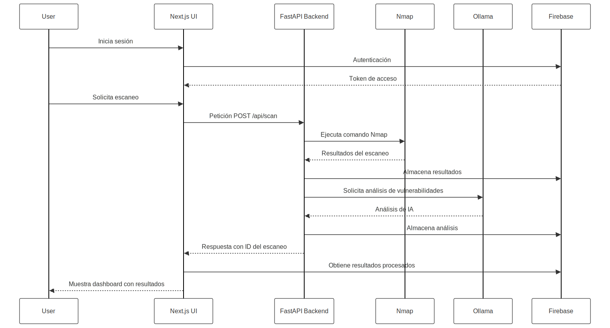

# EscanIA - Sistema de escaneo y análisis inteligente de redes

EscanIA es un sistema completo para el escaneo y análisis inteligente de redes que combina el poder del escaneo activo con Nmap y la inteligencia artificial para detectar vulnerabilidades, analizar patrones y generar reportes automatizados en tiempo real.

## Detalles de la arquitectura

1. **Arquitectura del Sistema**
   - Ver detalles en [General](./docs/doc-tecnica-general.md)

1. **escania-api**: Backend
   - Ver detalles en [escania-api](./docs/doc-tecnica-api.md)

1. **escania-ui**: Frontend
   - Ver detalles en [escania-ui](./docs/doc-tecnica-ui.md)

## Características principales

- **Escaneo de red avanzado**: Utiliza Nmap para detectar hosts, puertos abiertos y servicios en la red.
- **Análisis de vulnerabilidades**: Identifica automáticamente posibles vulnerabilidades basadas en servicios y versiones detectadas.
- **Procesamiento con IA**: Genera análisis detallados mediante inteligencia artificial (usando Ollama localmente u OpenAI).
- **Reportes completos**: Visualización detallada de resultados con gráficos, tablas y recomendaciones.
- **Escaneos programados**: Programa escaneos recurrentes para monitoreo continuo.
- **Interfaz web intuitiva**: Panel de control moderno y responsive basado en Next.js.

## Arquitectura

El sistema está dividido en dos componentes principales:

- **API Backend (escania-api)**: Servicio Python basado en FastAPI que maneja los escaneos y el procesamiento con IA.
- **UI Frontend (escania-ui)**: Interfaz de usuario construida con Next.js y React.
- **Firebase**: Base de datos y autenticación.



## Requisitos del sistema

- Docker y Docker Compose (recomendado)
- O alternativamente:
  - Python 3.12+ para el backend
  - Node.js 20+ y Bun para el frontend
  - Nmap instalado en el sistema

## Instalación y configuración

### Método recomendado: Docker

1. Clona el repositorio:
   ```bash
   git clone https://github.com/tu-usuario/escania.git
   cd escania
   ```

2. Configura las variables de entorno:
   ```bash
   # Copia y edita los archivos de configuración
   cp escania-api/env.template escania-api/.env
   cp escania-ui/env.template escania-ui/.env
   ```

3. Edita ambos archivos `.env` con tu configuración:
   - Configura las credenciales de Firebase
   - Ajusta la configuración de la IA (Ollama o OpenAI)
   - Configura los puertos si es necesario

4. Inicia los contenedores:
   ```bash
   sudo docker-compose up -d
   ```

5. Accede a la aplicación en tu navegador:
   ```
   http://localhost:3000
   ```

### Método alternativo: Instalación manual

#### Backend (escania-api)

Instalar [uv](https://github.com/astral-sh/uv):

1. Navega al directorio del backend:
   ```bash
   cd escania-api
   ```

2. Crea y activa un entorno virtual:
   ```bash
   uv venv
   source .venv/bin/activate  # En Windows: .venv\Scripts\activate
   ```

3. Instala las dependencias:
   ```bash
   uv sync
   ```

4. Configura las variables de entorno:
   ```bash
   cp env.template .env
   # Edita el archivo .env con tu configuración
   ```

5. Inicia el servidor:
   ```bash
   uvicorn escania.main:app --reload --port 8000
   ```

#### Frontend (escania-ui)

1. Navega al directorio del frontend:
   ```bash
   cd escania-ui
   ```

2. Instala Bun (si no lo tienes):
   ```bash
   npm install -g bun
   ```

3. Instala las dependencias:
   ```bash
   bun install
   ```

4. Configura las variables de entorno:
   ```bash
   cp env.template .env
   # Edita el archivo .env con tu configuración
   ```

5. Inicia el servidor de desarrollo:
   ```bash
   bun run dev
   ```

6. Accede a la aplicación en tu navegador:
   ```
   http://localhost:3000
   ```

## Uso con Task (opcional)

Si tienes [Task](https://taskfile.dev/) instalado, puedes usar los comandos predefinidos:

```bash
# Iniciar el backend
task api

# Iniciar el frontend
task ui
```

## Configuración de Firebase

El sistema utiliza Firebase como base de datos. Debes crear un proyecto en Firebase y configurar las siguientes características:

1. Authentication para la gestión de usuarios
2. Firestore Database para almacenar los datos de los escaneos
3. Generar una cuenta de servicio para la autenticación desde el backend

Las credenciales de Firebase deben configurarse en los archivos `.env` correspondientes.

## Configuración de la IA

EscanIA puede utilizar dos motores de IA para el análisis:

1. **Ollama (recomendado para uso local)**:
   - Instala Ollama siguiendo las instrucciones en [https://ollama.ai/](https://ollama.ai/)
   - Configura `AI_PROVIDER=ollama` en el archivo `.env` del backend
   - Descarga un modelo como `phi3:mini-4k` o similar

2. **OpenAI**:
   - Obtén una clave API de OpenAI
   - Configura `AI_PROVIDER=openai` y `OPENAI_API_KEY=tu-clave` en el archivo `.env` del backend

## Acceso a la aplicación

Una vez que la aplicación esté en funcionamiento, puedes acceder a:

- **Interfaz de usuario**: http://localhost:3000
- **API Backend**: http://localhost:8000

## Consideraciones de seguridad

- EscanIA requiere privilegios elevados para ejecutar Nmap correctamente.
- Si se ejecuta sin Docker, asegúrate de proporcionar los permisos necesarios.
- Cuando se usa Docker, el contenedor se configura con los privilegios necesarios.
- Utiliza EscanIA solo en redes donde tengas autorización explícita para realizar escaneos.
