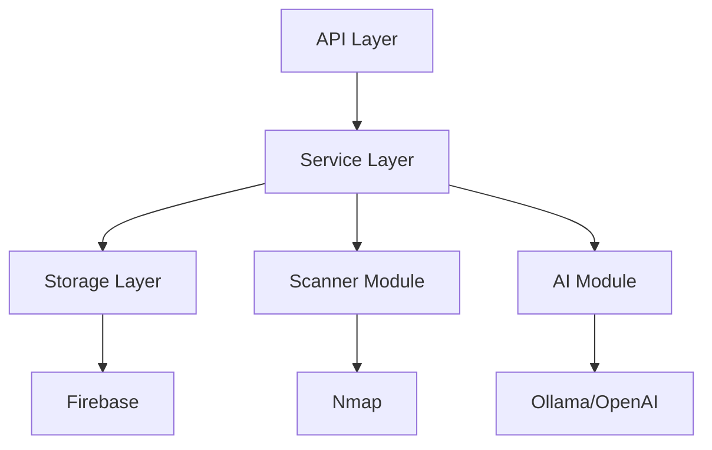
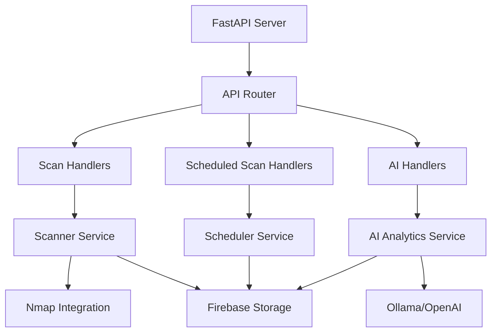
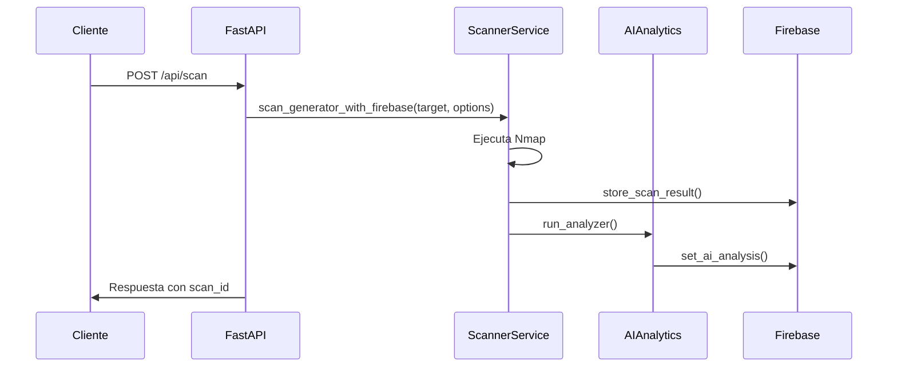
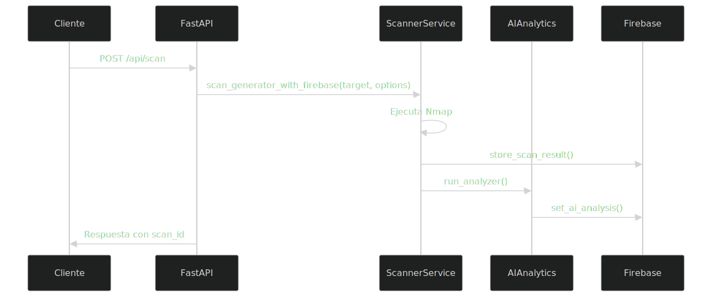
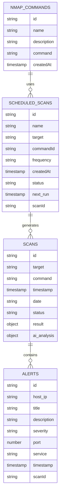

# Documentación Técnica de escania-api

## 1. Arquitectura del Sistema

### Diseño de la Arquitectura General

EscanIA-API es el componente backend del sistema EscanIA, diseñado con una arquitectura por capas que separa claramente las responsabilidades:




Esta arquitectura permite:
- **Separación de responsabilidades**: Cada componente tiene un propósito claro y definido
- **Flexibilidad**: Módulos intercambiables (diferentes proveedores de AI o bases de datos)
- **Mantenibilidad**: Cambios en una capa no requieren modificaciones en otras

### Componentes Principales y sus Interacciones




1. **API Layer (escania/api/)**:
   - Server: Punto de entrada (FastAPI)
   - Router: Enrutamiento de peticiones
   - Handlers: Procesadores de peticiones específicas

2. **Service Layer (escania/scan/services/)**:
   - Scanner Service: Ejecuta y procesa escaneos
   - AI Analytics: Análisis mediante IA
   - Vulnerability Detection: Detección de vulnerabilidades

3. **Storage Layer (escania/scan/storage/)**:
   - Firebase Integration: Almacenamiento principal
   - SQLite: Para tareas programadas

### Flujo de Datos




## 2. Requisitos Técnicos

### Requisitos Funcionales

1. **Escaneo de Red**:
   - Ejecutar escaneos Nmap con diferentes parámetros
   - Procesar y estructurar los resultados
   - Detectar hosts, puertos, servicios y sistemas operativos

2. **Programación de Tareas**:
   - Crear, actualizar y eliminar escaneos programados
   - Ejecutar tareas según configuración cron
   - Mantener historial de ejecuciones

3. **Análisis de Vulnerabilidades**:
   - Detectar vulnerabilidades basadas en servicios y versiones
   - Clasificar vulnerabilidades por severidad
   - Generar recomendaciones

4. **Análisis con IA**:
   - Analizar resultados usando IA
   - Generar reportes detallados en formato Markdown
   - Ofrecer recomendaciones específicas

### Requisitos No Funcionales

1. **Rendimiento**:
   - Respuesta asíncrona para escaneos (evitar bloqueo de la API)
   - Optimización para resultados de red extensos

2. **Seguridad**:
   - Validación de entradas
   - Integración segura con Firebase
   - Control de acceso adecuado

3. **Escalabilidad**:
   - Diseño modular para agregar nuevas funcionalidades
   - Soporte para diferentes proveedores de IA
   - Capacidad para manejar múltiples escaneos simultáneos

4. **Disponibilidad**:
   - Manejo de errores robusto
   - Recuperación ante fallos

### Dependencias de Software

- Python 3.12+
- Nmap (instalado en el sistema anfitrión)
- APScheduler
- FastAPI
- Firebase Admin SDK
- Pydantic
- SQLModel
- Python-nmap

## 3. Entorno de Desarrollo

### Tecnologías Utilizadas

- **Framework Web**: FastAPI
- **Gestión de Dependencias**: UV (sustituto moderno de pip)
- **Base de Datos Principal**: Firebase Firestore
- **Base de Datos de Tareas**: SQLite
- **Integración con Escáneres**: Python-nmap
- **Planificador de Tareas**: APScheduler
- **IA**: Ollama (local) o OpenAI (remoto)


## 4. Base de Datos

### Modelo de Datos (Firebase)




### Estructuras de Datos Clave

1. **ScanResult**:
   - Resultados procesados del escaneo
   - Incluye metadatos y datos estructurados de Nmap

2. **Vulnerability**:
   - Representa una vulnerabilidad detectada
   - Incluye información de severidad, descripción y recomendaciones

3. **Schedule**:
   - Configuración para escaneos programados
   - Incluye cronograma y parámetros de ejecución

## 5. APIs y Interfaces

### Endpoints API

| Método | Endpoint | Descripción | Parámetros |
|--------|----------|-------------|------------|
| GET | `/api/scan` | Inicia un escaneo | `target`, `command` |
| GET | `/api/scans` | Lista escaneos | `limit` (opcional) |
| GET | `/api/scans/{scan_id}` | Obtiene un escaneo | `scan_id` |
| POST | `/api/periodic-scan` | Programa un escaneo | `target`, `command`, `id_firestore`, `body` (cron) |
| DELETE | `/api/cancel-periodic-scan` | Cancela un escaneo | `id` |
| GET | `/api/periodic-scans` | Lista escaneos programados | - |
| GET | `/api/periodic-scan` | Obtiene un escaneo programado | `id` |
| GET | `/api/ai` | Ejecuta análisis IA | `message`, `id_firestore` (opcional) |

### Formatos de Intercambio de Datos

La API utiliza JSON para todas las comunicaciones. Ejemplos de estructuras:

```json
// Resultado de escaneo
{
  "id": "scan123",
  "target": "192.168.1.0/24",
  "command": "nmap -sV -O",
  "timestamp": {"seconds": 1616661000, "nanoseconds": 0},
  "date": "2024-03-25",
  "status": "completed",
  "result": {
    "192.168.1.1": {
      "status": {"state": "up", "reason": "echo-reply"},
      "tcp": {
        "22": {"state": "open", "name": "ssh", "product": "OpenSSH", "version": "8.2p1"},
        "80": {"state": "open", "name": "http", "product": "nginx", "version": "1.18.0"}
      }
    }
  }
}
```

## 6. Código Fuente

### Estructura del Proyecto

```
escania-api/
├── Dockerfile
├── LICENSE
├── README.md
├── env.template
├── pyproject.toml
└── escania/
    ├── __init__.py
    ├── main.py
    ├── api/
    │   ├── __init__.py
    │   ├── handlers/
    │   ├── router.py
    │   └── server.py
    ├── config/
    │   ├── __init__.py
    │   └── config.py
    └── scan/
        ├── __init__.py
        ├── schemas/
        │   ├── scan_schemas.py
        │   └── schemas.py
        ├── services/
        │   ├── __init__.py
        │   ├── ai_analytics.py
        │   ├── scanner_firebase.py
        │   └── vulns.py
        └── storage/
            ├── __init__.py
            ├── firebase/
            │   ├── __init__.py
            │   ├── alerts.py
            │   ├── core.py
            │   ├── scans.py
            │   └── sheduled.py
            └── sqlite.py
```

### Principales Módulos

1. **api/**: Contiene la API de FastAPI y los manejadores de peticiones
   - **server.py**: Configuración del servidor FastAPI
   - **router.py**: Definición de rutas
   - **handlers/**: Implementación de endpoints

2. **config/**: Configuración global
   - **config.py**: Variables de entorno y configuración

3. **scan/**: Core de la aplicación
   - **schemas/**: Modelos de datos (Pydantic)
   - **services/**: Lógica de negocio
   - **storage/**: Persistencia de datos

### Convenciones de Codificación

- **PEP 8**: Estándar para código Python
- **Docstrings**: Documentación en formato Google Style
- **Type Hints**: Anotaciones de tipo para mejor legibilidad

## 7. Guía de Despliegue

### Despliegue con Docker

```bash
# Construir la imagen
docker build -t escania-api .

# Ejecutar el contenedor
docker run -p 8000:8000 \
  -v /path/to/firebase-credentials.json:/app/firebase-credentials.json \
  -e FIREBASE_CREDENTIALS=/app/firebase-credentials.json \
  -e AI_PROVIDER=ollama \
  -e OLLAMA_BASE_URL=http://host.docker.internal:11434 \
  -e OLLAMA_MODEL=phi3:mini-4k \
  escania-api
```

### Despliegue Manual

```bash
# Crear entorno virtual
uv venv

# Activar entorno virtual
source .venv/bin/activate  # Linux/MacOS
.venv\Scripts\activate     # Windows

# Instalar dependencias
uv sync

# Ejecutar el servidor
uvicorn escania.main:app --host 0.0.0.0 --port 8000
```

## 8. Consideraciones de Seguridad

1. **Ejecución de Nmap**:
   - Requiere privilegios elevados
   - Limitar el alcance de escaneos
   - Filtrar comandos peligrosos

2. **Almacenamiento Seguro**:
   - Credenciales y secretos en variables de entorno
   - No almacenar tokens o claves en código fuente

3. **Validación de Entradas**:
   - Validar todos los parámetros de entrada
   - Prevenir inyección de comandos