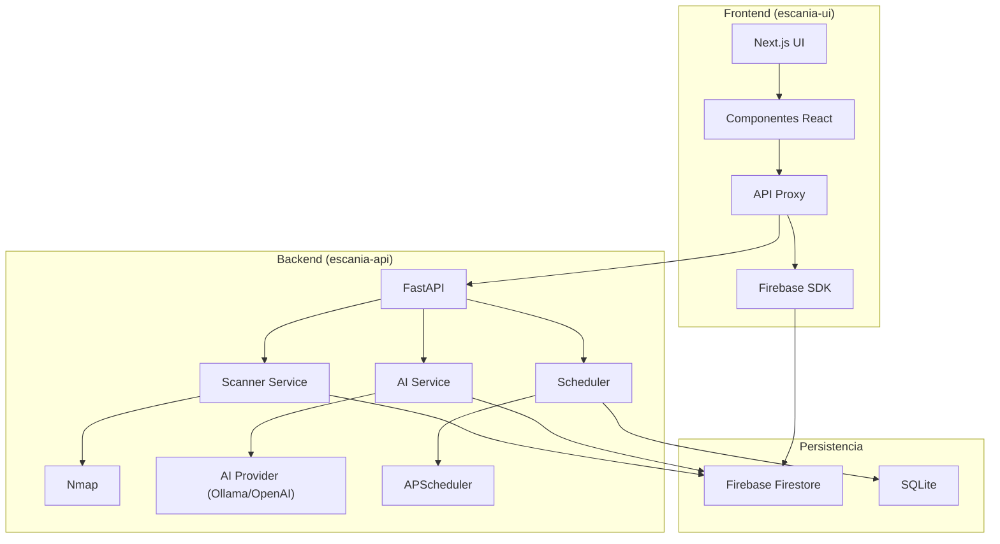
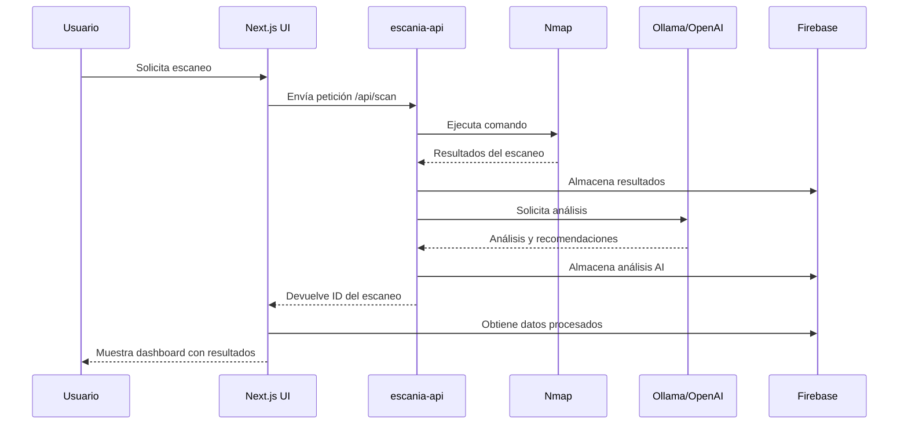
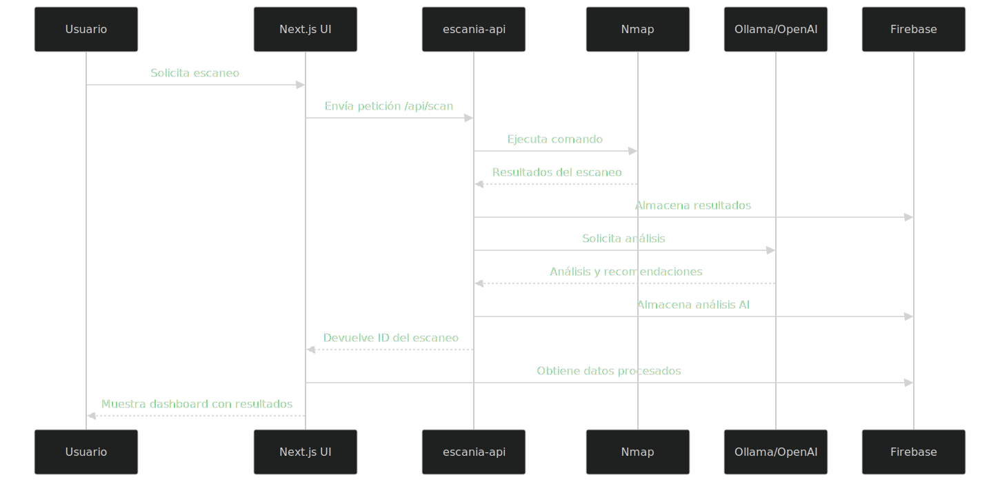
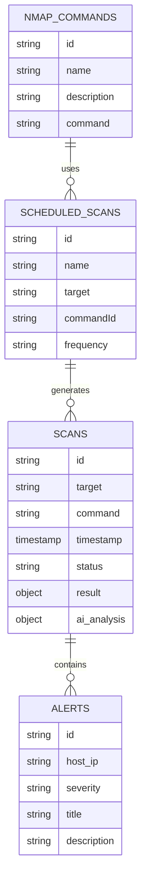

# EscanIA - Documentación Técnica General

Este documento proporciona una visión general técnica del sistema EscanIA, un sistema completo para el escaneo y análisis inteligente de redes que combina el poder del escaneo activo con Nmap y la inteligencia artificial.

## Arquitectura del Sistema

EscanIA sigue una arquitectura cliente-servidor moderna, con una clara separación entre el frontend y el backend:




### Componentes Principales

1. **escania-ui**: Frontend basado en Next.js
   - Interfaz de usuario
   - Visualización de datos
   - Autenticación
   - Gestión de escaneos

2. **escania-api**: Backend basado en FastAPI
   - Ejecución de escaneos Nmap
   - Análisis mediante IA
   - Programación de tareas
   - Detección de vulnerabilidades

3. **Firebase**: Base de datos y autenticación
   - Almacenamiento de resultados
   - Gestión de usuarios
   - Almacenamiento de configuraciones

## Flujo de Datos Principal




## Requisitos Técnicos

### Requisitos del Sistema

1. **Backend (escania-api)**:
   - Python 3.12+
   - Nmap instalado en el sistema
   - Acceso a Firebase
   - Acceso a un motor de IA (Ollama o OpenAI)

2. **Frontend (escania-ui)**:
   - Node.js 20+
   - Navegador web moderno
   - Conexión a internet para Firebase

### Dependencias Principales

#### Backend
- FastAPI
- Firebase Admin SDK
- Python-nmap
- APScheduler
- Pydantic/SQLModel

#### Frontend
- Next.js 14
- React 18
- Firebase JS SDK
- TailwindCSS
- Recharts
- shadcn/ui

## Modelo de Datos

EscanIA utiliza Firebase Firestore como base de datos principal, con las siguientes colecciones:




## APIs e Interfaces

### API Backend

El backend expone una API REST con los siguientes endpoints principales:

| Método | Endpoint | Descripción |
|--------|----------|-------------|
| GET | `/api/scan` | Inicia un escaneo |
| GET | `/api/scans` | Lista escaneos |
| GET | `/api/scans/{scan_id}` | Obtiene un escaneo |
| POST | `/api/periodic-scan` | Programa un escaneo |
| DELETE | `/api/cancel-periodic-scan` | Cancela un escaneo |
| GET | `/api/ai` | Ejecuta análisis IA |

### Interfaz Frontend

El frontend proporciona las siguientes vistas principales:

1. **Login**: Autenticación de usuarios
2. **Dashboard**: Visualización de resultados de escaneo
3. **Reportes**: Listado y detalles de reportes
4. **Administración**: Gestión de comandos y escaneos programados

## Estructura del Código

El proyecto está dividido en dos componentes principales:

1. **escania-api**: Backend
   - Ver detalles en [escania-api](./doc-tecnica-api.md)

2. **escania-ui**: Frontend
   - Ver detalles en [escania-ui](./doc-tecnica-ui.md)

## Entorno de Desarrollo

### Configuración con Docker

El método recomendado para desplegar el sistema es usando Docker Compose:

```bash
# Clonar el repositorio
git clone https://github.com/tu-usuario/escania.git
cd escania

# Configurar variables de entorno
cp escania-api/env.template escania-api/.env
cp escania-ui/env.template escania-ui/.env
# Editar ambos archivos .env con los valores correctos

# Iniciar los contenedores
docker-compose up -d
```

### Acceso a la Aplicación

Una vez iniciada, la aplicación está disponible en:
- **Frontend**: http://localhost:3000
- **Backend API**: http://localhost:8000/docs

## Consideraciones de Seguridad

1. **Ejecución de Nmap**:
   - Requiere privilegios elevados
   - Solo utilizar en redes con autorización

2. **Autenticación**:
   - Configurar Firebase adecuadamente
   - Implementar reglas de seguridad

3. **Datos Sensibles**:
   - No almacenar credenciales en código
   - Usar variables de entorno para secretos

## Guía de Integración con IA

EscanIA puede utilizar diferentes motores de IA:

1. **Ollama (Local)**:
   - Instalar Ollama (https://ollama.ai)
   - Configurar `AI_PROVIDER=ollama` en backend
   - Ideal para entornos sin conexión

2. **OpenAI (API)**:
   - Obtener clave API de OpenAI
   - Configurar `AI_PROVIDER=openai` y `OPENAI_API_KEY=tu-clave` en backend
   - Mayor precisión en análisis