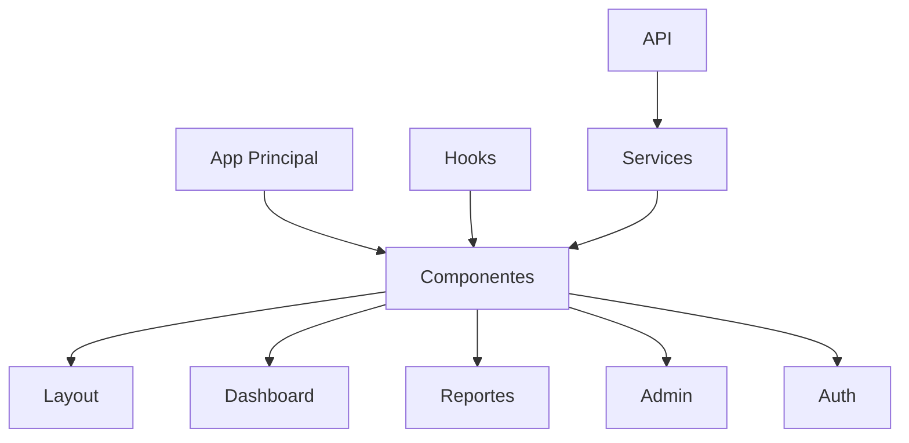
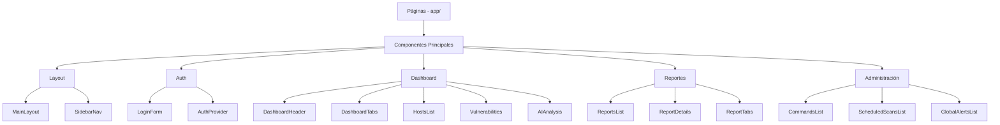
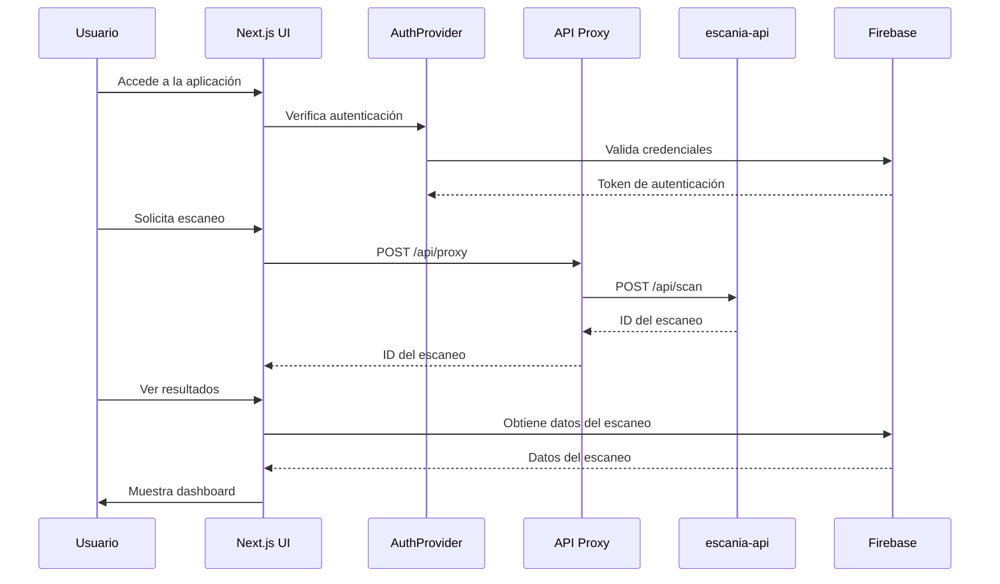
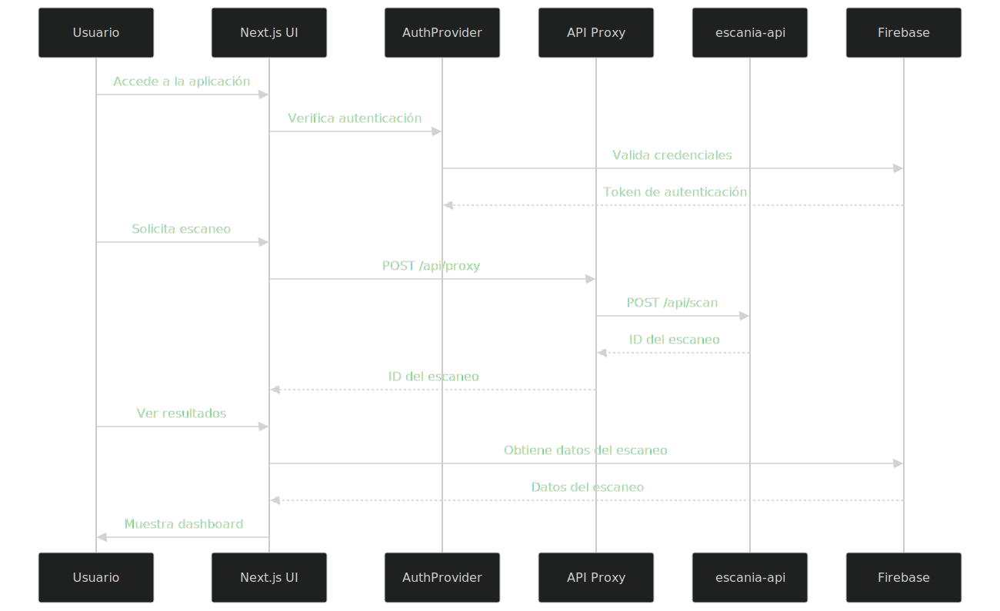

# Documentación Técnica de escania-ui

## 1. Arquitectura del Sistema

### Diseño de la Arquitectura General

EscanIA-UI es el componente frontend del sistema EscanIA, implementado como una aplicación web moderna basada en React y Next.js. La arquitectura sigue un enfoque modular y orientado a componentes:




La arquitectura del frontend está diseñada con los siguientes principios:

- **Componentización**: Interfaces divididas en componentes reutilizables
- **Client-side Rendering**: Navegación rápida entre rutas
- **Atomic Design**: Estructura jerárquica de componentes (átomos, moléculas, organismos, templates, páginas)
- **Gestión de Estado**: Usando hooks de React y SWR para datos remotos

### Componentes Principales y sus Interacciones




### Flujo de Datos




## 2. Requisitos Técnicos

### Requisitos Funcionales

1. **Autenticación y Autorización**:
   - Inicio de sesión seguro
   - Mantenimiento de sesión
   - Protección de rutas

2. **Dashboard Principal**:
   - Visualización de resumen de escaneos
   - Gráficas interactivas
   - Filtrado y búsqueda de datos

3. **Gestión de Escaneos**:
   - Visualización de escaneos realizados
   - Filtrado y búsqueda
   - Visualización detallada de resultados

4. **Administración**:
   - Gestión de comandos Nmap
   - Programación de escaneos recurrentes
   - Gestión de alertas

5. **Visualización de Vulnerabilidades**:
   - Listado de vulnerabilidades detectadas
   - Filtrado por severidad
   - Detalles y recomendaciones por vulnerabilidad

### Requisitos No Funcionales

1. **Usabilidad**:
   - Interfaz intuitiva y responsive
   - Tiempos de carga optimizados
   - Experiencia consistente en diferentes dispositivos

2. **Rendimiento**:
   - Carga de datos optimizada
   - Paginación para grandes volúmenes de datos
   - Renderizado eficiente de gráficos

3. **Seguridad**:
   - Protección contra CSRF
   - Validación de entradas
   - Encriptación de comunicaciones

4. **Mantenibilidad**:
   - Código modular y extensible
   - Convenciones de nomenclatura consistentes
   - Documentación adecuada

### Dependencias de Software

- Node.js 20+
- React 18+
- Next.js 14+
- Firebase JS SDK
- TailwindCSS
- Recharts
- SWR
- Lucide React
- Bun (gestor de paquetes)

## 3. Entorno de Desarrollo

### Tecnologías Utilizadas

- **Framework**: Next.js 14 (App Router)
- **Lenguaje**: TypeScript
- **Estilado**: TailwindCSS + shadcn/ui
- **Gráficos**: Recharts
- **Autenticación**: Firebase Authentication
- **Base de Datos**: Firebase Firestore
- **Gestión de Estado**: React Hooks + Context
- **Fetching de Datos**: SWR
- **Iconos**: Lucide React
- **Gestión de Paquetes**: Bun

### Control de Versiones

- **Sistema**: Git
- **Estructura de ramas**:
  - `main`: Código de producción estable
  - `develop`: Cambios integrados para la próxima versión
  - `feature/*`: Nuevas funcionalidades

## 4. Integración con Bases de Datos

### Firebase Integration

La aplicación se integra con Firebase para:

1. **Autenticación**:
   - Inicio de sesión basado en email/password
   - Mantenimiento de sesión

2. **Firestore**:
   - Almacenamiento y consulta de escaneos
   - Gestión de comandos y programaciones
   - Seguimiento de alertas

### Esquema de Datos (Cliente)

En el lado del cliente, los datos se transforman a interfaces TypeScript para mejor tipado:

```typescript
// Ejemplo de interfaz para resultados de escaneo
interface ScanResult {
  id?: string;
  target: string;
  command: string;
  date: string;
  status: string;
  timestamp: {
    seconds: number;
    nanoseconds: number;
  };
  result: Record<string, NmapHost>;
  processedData?: ProcessedScanData;
  ai_analysis?: AIAnalysis;
}

// Datos procesados para el dashboard
interface ProcessedScanData {
  hosts: ProcessedHost[];
  totalHosts: number;
  activeHosts: number;
  inactiveHosts: number;
  ports: {
    total: number;
    open: number;
    closed: number;
    filtered: number;
  };
  services: ServiceCount[];
  operatingSystems: OSCount[];
  topPorts: PortCount[];
  vulnerabilities: Vulnerability[];
}
```

## 5. APIs y Interfaces

### Comunicación con el Backend

La comunicación con el backend se realiza a través de:

1. **API Proxy**: `/app/api/proxy/route.ts`
   - Enruta peticiones al backend
   - Maneja autenticación
   - Formatea respuestas

2. **Firebase SDK**:
   - Consultas directas a Firestore
   - Operaciones de autenticación

### Endpoints Clave

| Método | Endpoint | Descripción | Parámetros |
|--------|----------|-------------|------------|
| GET | `/api/proxy` | Proxy para el endpoint de AI | `message`, `id_firestore` |
| POST | `/api/proxy` | Proxy para crear escaneos programados | `target`, `command`, `id_firestore`, `body` |
| DELETE | `/api/proxy` | Proxy para cancelar escaneos | `id` |

## 6. Código Fuente

### Estructura del Proyecto

```
escania-ui/
├── app/
│   ├── admin/
│   │   └── page.tsx
│   ├── alerts/
│   │   └── [id]/
│   │       └── page.tsx
│   ├── api/
│   │   └── proxy/
│   │       └── route.ts
│   ├── dashboard/
│   │   └── page.tsx
│   ├── login/
│   │   └── page.tsx
│   ├── reports/
│   │   └── page.tsx
│   ├── firebase.ts
│   ├── globals.css
│   ├── layout.tsx
│   └── page.tsx
├── components/
│   ├── admin/
│   │   ├── commands/
│   │   │   └── ...
│   │   ├── commands-list.tsx
│   │   ├── global-alerts-list.tsx
│   │   └── scheduled-scans-list.tsx
│   ├── auth/
│   │   ├── auth-provider.tsx
│   │   └── login-form.tsx
│   ├── dashboard/
│   │   ├── vulnerabilities/
│   │   │   └── ...
│   │   ├── ai-analysis.tsx
│   │   ├── dashboard-header.tsx
│   │   ├── dashboard-tabs.tsx
│   │   ├── hosts-list.tsx
│   │   └── scan-overview.tsx
│   ├── layout/
│   │   ├── main-layout.tsx
│   │   └── sidebar-nav.tsx
│   ├── reports/
│   │   ├── charts/
│   │   │   └── ...
│   │   ├── tabs/
│   │   │   └── ...
│   │   ├── alerts-table.tsx
│   │   └── report-details.tsx
│   └── ui/
│       └── ... (componentes shadcn/ui)
├── hooks/
│   ├── use-mobile.tsx
│   └── use-toast.ts
├── lib/
│   └── utils.ts
├── public/
│   └── ...
├── services/
│   └── scan-processor.ts
├── styles/
│   └── globals.css
├── types/
│   └── scan-types.ts
├── utils/
│   └── nmap-formatter.ts
├── Dockerfile
├── next.config.mjs
├── package.json
├── postcss.config.mjs
├── tailwind.config.js
└── tsconfig.json
```

### Principales Módulos

1. **app/**: Directorio principal de Next.js App Router
   - **Páginas**: Componentes de nivel superior para cada ruta
   - **API**: Endpoints de API Routes para el proxy al backend

2. **components/**: Componentes de React organizados por funcionalidad
   - **admin/**: Componentes para la sección de administración
   - **auth/**: Componentes de autenticación
   - **dashboard/**: Componentes para el dashboard principal
   - **layout/**: Componentes de estructura y navegación
   - **reports/**: Componentes para visualización de reportes
   - **ui/**: Componentes UI reutilizables

3. **hooks/**: Custom hooks de React
   - **use-mobile.tsx**: Detección de dispositivos móviles
   - **use-toast.ts**: Sistema de notificaciones

4. **services/**: Lógica de negocio
   - **scan-processor.ts**: Procesamiento de datos de escaneo

5. **types/**: Definiciones de tipos TypeScript
   - **scan-types.ts**: Interfaces para datos de escaneo

## 7. Guía de Despliegue

### Despliegue con Docker

```bash
# Construir la imagen
docker build -t escania-ui .

# Ejecutar el contenedor
docker run -p 3000:3000 \
  -e NEXT_PUBLIC_FIREBASE_API_KEY=your-api-key \
  -e NEXT_PUBLIC_FIREBASE_AUTH_DOMAIN=your-auth-domain \
  -e NEXT_PUBLIC_FIREBASE_PROJECT_ID=your-project-id \
  -e NEXT_PUBLIC_FIREBASE_STORAGE_BUCKET=your-storage-bucket \
  -e NEXT_PUBLIC_FIREBASE_MESSAGING_SENDER_ID=your-messaging-sender-id \
  -e NEXT_PUBLIC_FIREBASE_APP_ID=your-app-id \
  escania-ui
```

### Despliegue Manual

```bash
# Instalar dependencias
bun install

# Construir para producción
bun run build

# Iniciar servidor de producción
bun run start
```

## 8. Consideraciones de Seguridad

1. **Autenticación**:
   - No almacenar tokens en localStorage
   - Implementar cierre de sesión automático por inactividad
   - Validar permisos de usuario

2. **Datos Sensibles**:
   - No mostrar información completa de vulnerabilidades críticas sin confirmación
   - Enmascarar IPs y datos sensibles en reportes exportables

3. **Validación de Entradas**:
   - Sanitizar todas las entradas de usuario
   - Validar formularios antes de envío
   - Prevenir XSS con escape adecuado

4. **Comunicación API**:
   - Usar HTTPS para todas las comunicaciones
   - Incluir validación de origen en peticiones
   - Implementar rate limiting en el proxy

## 9. Optimizaciones para Rendimiento

1. **Carga de Datos**:
   - Implementación de SWR para caché y revalidación
   - Carga progresiva para grandes conjuntos de datos
   - Lazy loading de componentes pesados

2. **Renderizado**:
   - Optimización de componentes con React.memo
   - Uso de useCallback y useMemo para funciones y valores calculados
   - Virtualized lists para grandes conjuntos de datos

3. **Imágenes y Recursos**:
   - Optimización automática de imágenes con Next.js
   - Lazy loading de recursos no críticos
   - Prefetching de rutas comunes